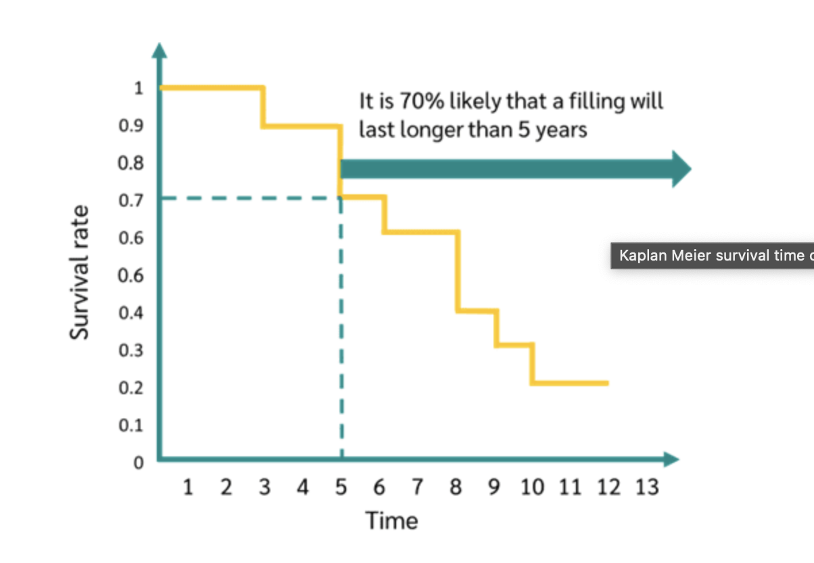

## Survival Analysis

### References

**Web Sources**

1. [Emily C. Zabor: Survival Aanalysis in R](https://www.emilyzabor.com/tutorials/survival_analysis_in_r_tutorial.html)

2. [A short course on Survival Analysis applied to the Financial Industry](https://bookdown.org/sestelo/sa_financial/)

3. [Survival Analysis in R For Beginners](https://www.datacamp.com/tutorial/survival-analysis-R)

4. [Survival Analysis with R](https://rviews.rstudio.com/2017/09/25/survival-analysis-with-r/)

5. [Survival Analysis Basics](http://www.sthda.com/english/wiki/survival-analysis-basics)

6. [Steps to perform Survival Analysis in R](https://www.r-bloggers.com/2018/03/steps-to-perform-survival-analysis-in-r/)

7. [Survival Analysis with R, Harvard](http://tagteam.harvard.edu/hub_feeds/1981/feed_items/2286128)

8. [Survival Analysis: Lisa Sullivan, PhD](https://sphweb.bumc.bu.edu/otlt/MPH-Modules/BS/BS704_Survival/BS704_Survival_print.html)

9. [Survival Analysis Part I: Basic concepts and first analyses](https://www.nature.com/articles/6601118.pdf)

10. [Practical Guide Paper](https://www.ncbi.nlm.nih.gov/pmc/articles/PMC3932959/pdf/nihms549224.pdf)

11. [An Introduction to Survival Statistics: Kaplan-Meier Analysis](https://www.ncbi.nlm.nih.gov/pmc/articles/PMC5045282/)

12. [Kaplan Meier curves: an introduction](https://towardsdatascience.com/kaplan-meier-curves-c5768e349479)

13. [NCCTG Lung Cancer Data](https://stat.ethz.ch/R-manual/R-devel/library/survival/html/lung.html)

**pdf references**

<!-- <iframe src="data_setup_alternative.pdf" style="width:100%; height:100px;"></iframe> -->

<!-- <a href=survival_pdf/survival_data_setup_alternative.pdf>1. Data Setup Alternative</a> -->

[1. Data Setup Alternative](survival_pdf/survival_data_setup_alternative.pdf)

[2. Introduction to Survival Analysis in Practice](survival_pdf/survival_Intro_Survival_Analysis_Practice.pdf)

[3. Chapter 7 - Survival Models](survival_pdf/survival_lecture_note.pdf)

[4. Notes from Pat](survival_pdf/survival_notes_pat.pdf)

[5. Parametric Survival Models](survival_pdf/Survival_parametric.pdf)

[6. Retain Customers by Churn model](survival_pdf/survival_retain_customers.pdf)

[7. Intro to Survival Analysis](survival_pdf/survival_intro.pdf)

### Time to event analysis

Time to event analysis has also been used widely in the social sciences where interest is on analyzing time to events such as job changes, marriage, birth of children and so forth. 

There are certain aspects of survival analysis data, such as censoring and non-normality, that generate great difficulty when trying to analyze the data using traditional statistical models such as multiple linear regression. 

The non-normality aspect of the data violates the normality assumption of most commonly used statistical model such as regression or ANOVA, etc. 

A censored observation is defined as an observation with incomplete information.
When an observation is right censored it means that the information is incomplete because the subject did not have an event during the time that the subject was part of the study.

The point of survival analysis is to follow subjects over time and observe at which point in time they experience the event of interest. 

It often happens that the study does not span enough time in order to observe the event for all the subjects in the study. This could be due to a number of reasons. Perhaps subjects drop out of the study for reasons unrelated to the study (i.e. patients moving to another area and leaving no forwarding address). 

The common feature of all of these examples is that if the subject had been able to stay in the study then it would have been possible to observe the time of the event eventually.

Type of censoring
-	Right truncation
-	Right censoring
-	Left truncation
-	Left censoring

In survival analysis, censoring refers to situations where the event of interest (e.g., death, failure, or another outcome) is not observed for some subjects during the study period. There are two main types of censoring: right truncation and right censoring.

1. **Right Truncation:**
   - **Definition:** Right truncation occurs when individuals enter the study at different times, and some individuals have already experienced the event of interest before the study begins.
   - **Example:** Consider a study on the time until a machine fails. If the study starts at a certain date, and some machines have already failed before that date, those machines are considered right-truncated because their failure times are not observed in the study.

2. **Right Censoring:**
   - **Definition:** Right censoring occurs when individuals are followed for a certain period, but the event of interest does not occur for some of them by the end of the study.
   - **Example:** In a clinical trial studying the time until disease recurrence, if a patient has not experienced recurrence by the end of the study period or is lost to follow-up, their survival time is right-censored. The exact time of recurrence is not known for these patients.

In summary, right truncation involves incomplete observation due to some subjects entering the study late, whereas right censoring occurs when the event of interest has not occurred for some subjects by the end of the study. Both types of censoring are common in survival analysis and need to be appropriately accounted for in statistical models to obtain unbiased estimates of survival probabilities and hazard rates.

**What is survival data?**

Time-to-event data that consist of a distinct start time and end time.

Examples from cancer
•	Time from surgery to death
•	Time from start of treatment to progression
•	Time from response to recurrence

Examples from other fields

Time-to-event data are common in many fields including, but not limited to
•	Time from HIV infection to development of AIDS
•	Time to heart attack
•	Time to onset of substance abuse
•	Time to initiation of sexual activity
•	Time to machine malfunction

Types of censoring

A subject may be censored due to:
•	Loss to follow-up
•	Withdrawal from study
•	No event by end of fixed study period

Specifically these are examples of right censoring.

Left censoring and interval censoring are also possible, and methods exist to analyze this type of data.

#### Survival rate

Suppose you're a dental technician and you want to study the "survival time" of a filling in a tooth.

So your start time is the moment when a person goes to the dentist for a filling, and your end time, the event, is the moment when the filling breaks. The time between these two events is the focus of your study.

For example, you may be interested in the probability that your filling will last longer than 5 years. To do this, you read off the value at 5 years on the graph, which is the survival rate. At 5 years, the Kaplan-Meier curve gives you a value of 0.7. So there is a 70% chance that your filling will last longer than 5 years.

