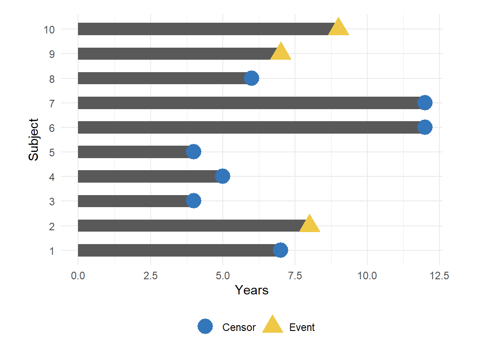

```{r, include=FALSE}
# rm(list = setdiff(ls(), c("connection")))

pckg = c("knitr", "dplyr", "survival", "ggplot2", "here", "tibble", "devtools")

is.installed <- function(p){
                    is.element(p, installed.packages()[,1])}

for(i in 1:length(pckg)) {
                          if (!is.installed(pckg[i])){
                              install.packages(pckg[i])
                          }
}

if (!is.installed("ezfun")){ devtools::install_github("zabore/ezfun") }
```

```{r}
library(knitr)
library(dplyr)
library(survival)
library(ggplot2)
library(tibble)

# devtools::install_github("zabore/ezfun")
ezfun::set_ccf_palette("contrast")
```

#### The basics

[Original article](https://www.emilyzabor.com/tutorials/survival_analysis_in_r_tutorial.html)

Survival data are time-to-event data that consist of a distinct start time and end time.

Examples from cancer:

- Time from surgery to death
- Time from start of treatment to progression
- Time from response to recurrence
- Time-to-event data are common in many other fields. 

Some other examples include:

- Time from HIV infection to development of AIDS
- Time to heart attack
- Time to onset of substance abuse
- Time to initiation of sexual activity
- Time to machine malfunction

Because time-to-event data are common in many fields, it also goes by names besides survival analysis including:

- Reliability analysis
- Duration analysis
- Event history analysis
- Time-to-event analysis

A key feature of survival data is censoring.

Censoring occurs if a subject has not experienced the event of interest by the end of data collection.

A subject may be censored due to:

- Loss to follow-up
- Withdrawal from study
- No event by end of fixed study period

Specifically these are examples of **right censoring.**

**Left censoring** and **interval censoring** are also possible, and methods exist to analyze these types of data, but this tutorial will be focus on right censoring.

To illustrate the impact of censoring, suppose we have the following data:



How would we compute the proportion who are event-free at 10 years?

- Subjects 6 and 7 were event-free at 10 years.
- Subjects 2, 9, and 10 had the event before 10 years.
- Subjects 1, 3, 4, 5, and 8 were censored before 10 years, so we don’t know whether they had the event or not at 10 years. But we know something about them - that they were each followed for a certain amount of time without the event of interest prior to being censored.


Survival analysis techniques provide a way to appropriately account for censored patients in the analysis.

```{r}
# install.packages(c("lubridate", "ggsurvfit", "gtsummary", "tidycmprsk"))
library(lubridate)
library(ggsurvfit)
library(gtsummary)
library(tidycmprsk)

# devtools::install_github("zabore/condsurv")
library(condsurv)
```


**The lung dataset**

Throughout this section, we will use the `lung` dataset from the `survival` package as example data. The data contain subjects with advanced lung cancer from the North Central Cancer Treatment Group. We will focus on the following variables throughout this tutorial:

     **time:** Observed survival time in days
     **status:** censoring status 1=censored, 2=dead
     **sex:** 1=Male, 2=Female

```{r}
head(lung[, c("time", "status", "sex")])
```

Note that the status is coded in a non-standard way in this dataset. Typically you will see 1=event, 0=censored. Let’s recode it to avoid confusion:

```{r}
lung1 <- 
  lung %>% 
  mutate(
    status = recode(status, '1' = 0, '2' = 1)
  )

head(lung[, c("time", "status", "sex")])
```


Now we have:

    time: Observed survival time in days
    status: censoring status 0=censored, 1=dead
    sex: 1=Male, 2=Female

Note: the `Surv()` function in the {`survival`} package accepts by default TRUE/FALSE, where TRUE is event and FALSE is censored; 1/0 where 1 is event and 0 is censored; or 2/1 where 2 is event and 1 is censored. Please take care to ensure the event indicator is properly formatted.


**Calculating survival times**

Data will often come with start and end dates rather than pre-calculated survival times. The first step is to make sure these are formatted as dates in R.

Let’s create a small example dataset with variables `sx_date` for surgery date and `last_fup_date` for the last follow-up date:


```{r}
date_ex <- 
  tibble(
    sx_date = c("2007-06-22", "2004-02-13", "2010-10-27"), 
    last_fup_date = c("2017-04-15", "2018-07-04", "2016-10-31")
    )

date_ex
```

We see these are both `character` variables, but we need them to be formatted as `dates.`

We will use the {`lubridate`} package to work with dates. In this case, we need to use the `ymd()` function to change the format, since the dates are currently in the character format where the year comes first, followed by the month, and followed by the day.

```{r}
date_ex1 <-
  date_ex %>% 
  mutate(
    sx_date = ymd(sx_date), 
    last_fup_date = ymd(last_fup_date)
    )

date_ex1
```

Now that the dates are formatted, we need to calculate the difference between start and end dates in some units, usually months or years. Using the {`lubridate`} package, the operator `%--%` designates a time interval, which is then converted to the number of elapsed seconds using `as.duration()` and finally converted to years by dividing by `dyears(1)`, which gives the number of seconds in a year.

```{r}
date_ex2 <-
  date_ex1 %>% 
  mutate(
    observed_yrs = as.duration(sx_date %--% last_fup_date) / dyears(1)
    )

date_ex2
```

#### Creating survival objects and curves

The Kaplan-Meier method is the most common way to estimate survival times and probabilities. It is a `non-parametric` approach that results in a step function, where there is a step down each time an event occurs.

Lets see the data again:

```{r}
lung[, c("time", "status")][1:5, ]
```


The `Surv()` function from the {`survival`} package creates a survival object for use as the response in a model formula. There will be one entry for each subject that is the survival time, which is followed by a + if the subject was censored. 

Let’s look at the first 10 observations:

```{r}
Surv(lung$time, lung$status)[1:10]
```

We see that subject 1 had an event at time 306 days, subject 2 had an event at time 455 days, subject 3 was censored at time 1010 days, etc.

The `survfit()` function creates survival curves using the Kaplan-Meier method based on a formula. Let’s generate the overall survival curve for the entire cohort, assign it to object s1, and look at the structure using `str()`:

```{r}
s1 <- survfit(Surv(time, status) ~ 1, data = lung)
str(s1)
```


#### Kaplan-Meier plots/Curves

The Kaplan Meier curve graphically represent the survival rate or survival function. Time is plotted on the x-axis and the survival rate is plotted on the y-axis.

We will use the {`ggsurvfit`} package to generate Kaplan-Meier plots. 

This package aims to ease plotting of time-to-event endpoints using the power of the {`ggplot2`} package. See http://www.danieldsjoberg.com/ggsurvfit/index.html for details.

Note: alternatively, survival plots can be created using base R or the {`survminer`} package.

The {`ggsurvfit`} package works best if you create the `survfit` object using the included `ggsurvfit::survfit2()` function, which uses the same syntax to what we saw previously with `survival::survfit()`.

The `ggsurvfit::survfit2()` tracks the environment from the function call, which allows the plot to have better default values for labeling and p-value reporting.

```{r}
survfit2(Surv(time, status) ~ 1, data = lung) %>% 
  ggsurvfit() +
  labs(
    x = "Days",
    y = "Overall survival probability"
  )
```


The default plot in `ggsurvfit()` shows the step function only. 

We can add the confidence interval using `add_confidence_interval()`:

```{r}
survfit2(Surv(time, status) ~ 1, data = lung) %>% 
  ggsurvfit() +
  labs(
    x = "Days",
    y = "Overall survival probability"
  ) + 
  add_confidence_interval()
```


Typically we will also want to see the numbers at risk in a table below the x-axis.

We can add this using `add_risktable()`:

```{r}
survfit2(Surv(time, status) ~ 1, data = lung) %>% 
  ggsurvfit() +
  labs(
    x = "Days",
    y = "Overall survival probability"
    ) + 
  add_confidence_interval() +
  add_risktable()
```


