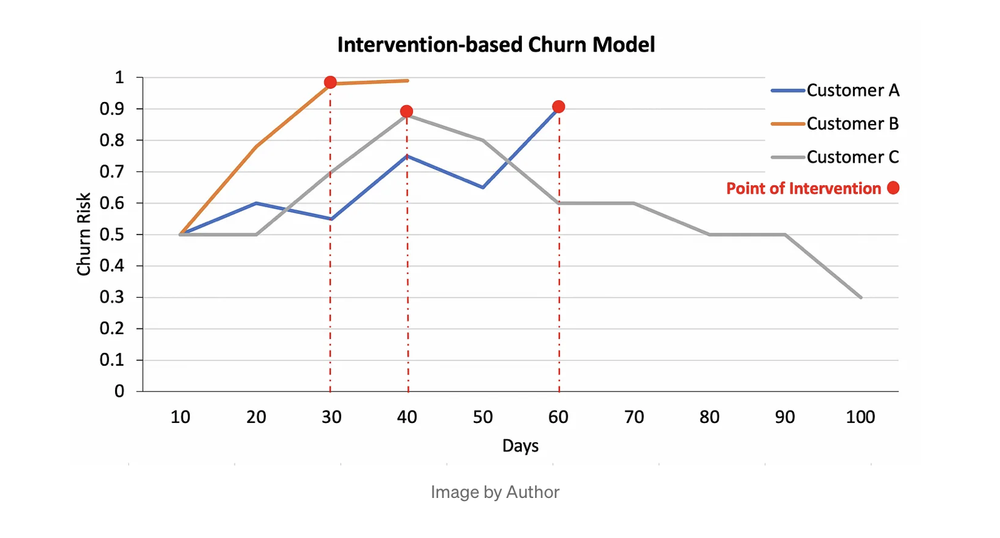
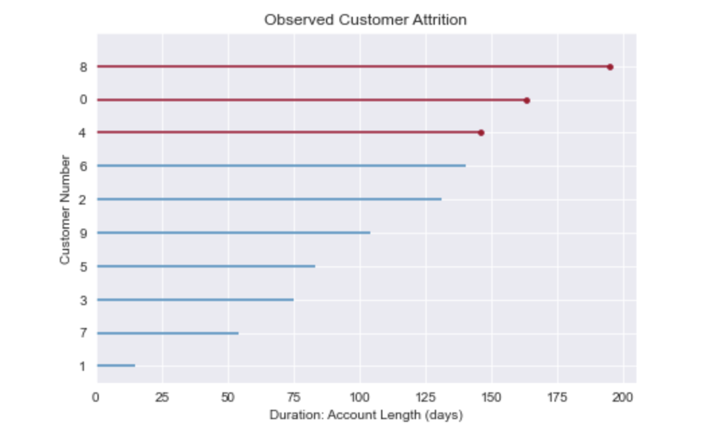
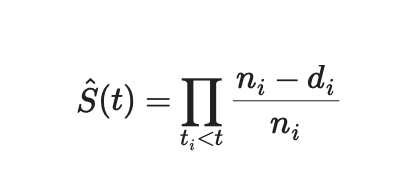

### Customer Churn

It usually costs more to acquire a customer than it does to retain a customer.

Focusing on customer retention enables companies to maximize customer revenue over their lifetime.

These models are seldom done optimally as they rely on binary classification flags (churn yes or no). Churn classification models do not tell WHEN a customer is likely to leave but only indicate that it’s going to happen within a certain number of days or months.

In the churn classification model, we dont usually account for the differences in time.

It is probably a mistake to treat a customer that is at risk of leaving in 40 days the same as a customer that remains for over a 100 days. Traditional churn modeling does not make this differentiation.


As it fails to account for time, we have no clear idea at what point a marketing intervention is needed and it causes preventable customer attrition.

The only point in time here is the “within 40 days” threshold. As it fails to account for time, we have no clear idea at what point a marketing intervention is needed and it causes preventable customer attrition.

#### Re-framing the Problem to Know When

Rather then use a binary classifier, we are going to re-frame the problem as time-dependent one. This enables us to intervene at the right time to stop customer attrition before it happens. 

No longer relying on thresholds, we now set churn as continuous time conditioned event. As the below graph shows, we now know the time that attrition risk is most likely to happen.



No longer is time held constant, we now track risk over time to determine when a marketing intervention is needed to retain the customer.

If we model for both the time and event, the right moment to intervene and prevent attrition is apparent. A modeling technique called `Survival Analysis` allows for us to do this and with the advent of modern Machine Learning, it’s now a trivial task. 

```{python, eval=F}
%reload_ext autoreload
%autoreload 2
%matplotlib inline

import xgboost as xgb
import shap
import sksurv.metrics as surv_metrics
from sksurv.datasets import get_x_y
from lifelines import KaplanMeierFitter
from lifelines.plotting import plot_lifetimes
import numpy as np
import pandas as pd
import seaborn as sns
from matplotlib import pyplot as plt
from sklearn.compose import ColumnTransformer
from sklearn.exceptions import DataConversionWarning
from sklearn.impute import SimpleImputer
from sklearn.model_selection import train_test_split
from sklearn.pipeline import Pipeline
from sklearn.preprocessing import OneHotEncoder, StandardScaler


plt.rcParams['figure.figsize'] = [7.2, 4.8]
pd.set_option("display.float_format", lambda x: "%.4f" % x)

sns.set_style('darkgrid')

SEED = 123
```


```{python, eval=F}
df = pd.read_csv("../../data/churn.txt")
# denoting churn and duration
df["event"] = np.where(df["churn?"] == "False.", 0, 1) df = df.rename(columns={"account_length": "duration"})
del df['churn?']
df = df.dropna()
df = df.drop_duplicates()
df.head()
```

```{python, eval=F}
print("Total Records:",df.shape[0],"\n")
print("Percent Churn Rate:",df.event.mean())
print("")
print("Duration Intervals")
print(df['duration'].describe())
```

For Survival models data is different from a traditional classification problem and requires:
- A Censor — For our purposes these are customers who’ve yet to churn. Read about right censoring here.

- Duration — The duration or time t of the customer’s activity. In this case, it’s Account Length in days.

- Event — The binary target, in this case if they terminated their phone plan marked by Churn? .

```{python, eval=F}
ax = plot_lifetimes(df.head(10)['duration'], df.head(10)['event'])
_=ax.set_xlabel("Duration: Account Length (days)") _=ax.set_ylabel("Customer Number") _=ax.set_title("Observed Customer Attrition")
```





In the above plot, the red lines indicates when a customer has left with the dots indicating the specific point in time. 

Blue lines are customers that are still active up to the time measured on the x-axis in Duration.

Here we see that customer number 8 did not attrit until up to 195 days, with customer numbers 0 and 4 leaving in 163 and 146 days respectively. All other customers are still active.

Notice how all customers are set on the same time scale because the data is analytically aligned. Each customer might have come in at different times but we’ve set the days as the same.

This is what allowed us to right-censor the data on the churn event. Real world data needs both censoring and aligning before modeling can begin.


#### The Risk of Churn

A more informative approach might be to estimate the Survival Function or the time in days a customer has until they attrit. For this purpose, we will use a Kaplan Meier Estimator to calculate how long until attrition occurs. The estimator is defined as:



Where $𝑑_𝑖$ are the number of churn events at time $𝑡$ and $𝑛_𝑖$ is the number of customers at risk of churn just prior to time $𝑡$.

We will use the great python package `lifelines` to plot the Survival Function as the function is a component of the final churn model.


```{python, eval=F}
kmf = KaplanMeierFitter()
kmf.fit(df['duration'], event_observed=df['event'])
kmf.plot_survival_function()

_=plt.title('Survival Function for Telco Churn'); _=plt.xlabel("Duration: Account Length (days)")
_=plt.ylabel("Churn Risk (Percent Churned)") 
_=plt.axvline(x=kmf.median_survival_time_, color='r',linestyle='--')
```


Let’s look at the `median` survival time. This is the point by which half of customers have churned out. According to this graph, where it’s marked by the red dotted line, by about 152 days half of customers churn.

This is helpful because it gives overall baseline when intervention is needed. However, for each individual customer this is uninformative.
**What is missing is the point in time in which churn risk is highest for each customer.**

For that we will create a model using `Cox’s Proportional Hazard` which uses a log-risk function $h(x)$. The Hazard function is conditioned on rate of a customers remaining until time t or later, this allows to estimate the risk of churn overtime. 

This will enable us to score each customer and anticipate when a marketing intervention is needed. However, before we proceed to that, we need to preprocess the data.

#### Data Splitting and Preprocessing

First we will split the data into training and testing. We’ll use the testing set as the validation for the example. 

    In practice, you want all three of these splits so that you don’t tune to the validation set.
    
Next, we take the numeric features and categorical features and then preprocess them for downstream modeling. 

In the case of categories, we will first impute with the constant and then simply one-hot encode them. In the case of numerics, we will fill with the median then standardize them between values of 0 and 1. This is all wrapped into Sklearn’s Pipeline and ColumnTransformer for simplicity’s sake.
As part of the Churn Pipeline all these steps are included with the final preprocessor saved for use at inference time.


